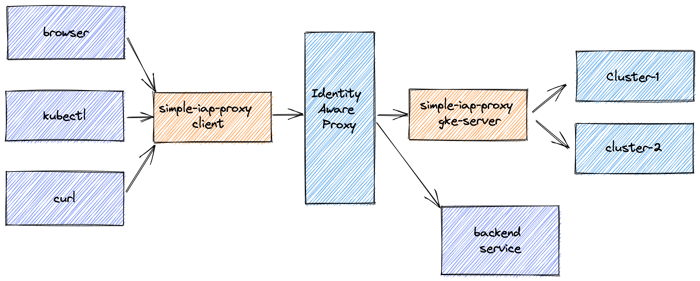

simple Google IAP proxy
=======================
This is a simple IAP HTTP/S proxy. It will intercept the required HTTPS request and
inject the IAP proxy authorization header.



```
Usage:
simple-iap-proxy [command]

Available Commands:
client               starts a client side proxy, forwarding requests via an IAP endpoint
gke-server           forwards requests to GKE clusters
generate-certificate generates a self-signed localhost certificate

Flags:
-k, --key-file string           key file for serving https
-c, --certificate-file string   certificate of the server
-d, --debug                     provide debug information
-P, --port int                  port to listen on (default 8080)
-p, --project string            google project id to use
```


## simple-iap-proxy client

The client will start a real HTTP/S proxy and forward any requests for
ip addresses of GKE cluster master endpoints or specified hostnames to the IAP proxy.
Adds the required ID token as the Proxy-Authorization header in the request. Generates self-signed
certificates for the targeted hosts on the fly.

```
Usage:
simple-iap-proxy client [flags]

Flags:
-t, --target-url string         to forward requests to
-a, --iap-audience string       of the IAP application
-s, --service-account string    to impersonate
-u, --use-default-credentials   use default credentials instead of gcloud configuration
-C, --configuration string      name of gcloud configuration to use for credentials
-G, --to-gke                    proxy to GKE clusters in the project
-H, --to-host strings           proxy to these hosts, specified as regular expression
    --http-protocol             listen on HTTP instead of HTTPS
```

## simple-iap-proxy gke-server

Reads the Host header of the http requests and if it matches the ip address of a GKE cluster master endpoint,
forwards the request to it. Reject requests for any other endpoint. 
```
Usage:
simple-iap-proxy gke-server
```


## simple-iap-proxy generate-certificate

generates a private key and self-signed certificate which can be used to
serve over HTTPS.

```
Usage:
simple-iap-proxy generate-certificate [flags]

Flags:
--dns-name string   on the certificate (default "localhost")
```

## examples
There are two examples you can try out:

- [IAP proxy to a GKE clusters](examples/to-gke-clusters/README.md)
- [IAP Proxy to a normal service](examples/to-service/README.md)

## installing the IAP proxy
Install the simple-iap-proxy by downloading the latest release 
from [github.com/binxio/simple-iap-proxy](https://github.com/binxio/simple-iap-proxy/releases).

## Limitations
- The client proxy only supports a single IAP proxy endpoint url as a target.

## Caveats
- The IAP protocol does not support websockets as Authorization header cannot be passed in. Commands which rely
  on websockets will fail (ie kubectl exec).
- The proxy is beta software, so I am happy to hear your feedback!

[Read the blog](https://binx.io/blog/2021/12/11/how-to-connect-to-a-gke-private-endpoint-using-iap/)
