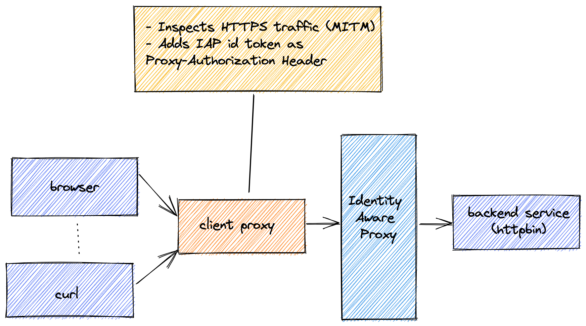

example simple IAP proxy for IAP protected services
====================================================
The simple IAP proxy, can also be used to call any service behind an IAP proxy. For instance, a website
in the development environment which you do want to be exposed to the public internet.

This example deploys httpbin as a backend service behind the IAP proxy.


## prerequisites
To deploy the example IAP proxy you need the following:

- a google project id with a default network
- a Google DNS managed zone, which is publicly accessible
- a user you want to grant access

To configure your deployment, create a file `.auto.tfvars` with the following content:

```hcl
# project and region to deploy to IAP proxy into
project = "my-project"
region = "europe-west4"

## DNS managed zone accessible from the public internet
dns_managed_zone = "my-managed-zone"

## users you want to grant access via the IAP proxy
accessors = [
    "user:markvanholsteijn@binx.io",
]

# support email address for the IAP brand.
# if there is an IAP brand in your project, make this empty string: ""
# To check whether you already have a brand, type `gcloud alpha iap oauth-brands list`
iap_support_email = "markvanholsteijn@binx.io"
```

## deploying the sample service
To deploy the sample service, type:

```sh
git clone https://github.com/binxio/simple-iap-proxy.git
cp .auto.tfvars simple-iap-proxy/examples/to-service
terraform init
terraform apply
```

After the apply, the required IAP client proxy command is printed:
```
iap_proxy_command = <<EOT
simple-iap-proxy client \
  --target-url https://httpbin.example.com \
  --iap-audience 123123123123-j9onig1ofcgle7iogv8fceu04v8hriuv.apps.googleusercontent.com \
  --service-account iap-proxy-accessor@my-project.iam.gserviceaccount.com \
  --key-file server.key \
  --certificate-file server.crt \
  --to-host httpbin.example.com

EOT
```

## create a self-signed certificate
To start the IAP client proxy, you need a certificate. To generate a self-signed certificate, type:

```bash
simple-iap-proxy generate-certificate \
  --key-file server.key \
  --certificate-file server.crt
 ```

Or alternatively, use openssl:
```bash
openssl genrsa -out server.key 2048
openssl req -new -x509 -sha256 \
    -key server.key \
    -subj "/CN=simple-iap-proxy" \
    -addext "subjectAltName = DNS:localhost" \
    -days 3650 \
    -out server.crt
```

## trust the self-signed certificate
To trust the self-signed certificate, add the certificate to the trust store. On MacOS, type:

```bash
sudo security add-trusted-cert -d -p ssl -p basic -k /Library/Keychains/System.keychain ./server.crt
```

On Linux, type:
```bash
cp server.crt /etc/ssl/certs/
c_rehash
```

## start the proxy
Now you can start the proxy, by copying the command printed by terraform:

```sh
$ terraform output -raw iap_proxy_command | bash
```

## use the proxy
to use the proxy, point to the proxy for HTTPS traffic and use the desired client:

```bash
export HTTPS_PROXY=https://localhost:8080
export NO_PROXY='.googleapis.com'
curl https://httpbin.example.com/anything
```
